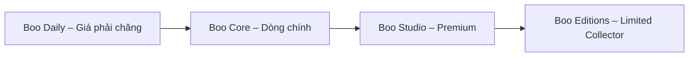

# Tóm tắt điều hành

Báo cáo này đề xuất chiến lược thương hiệu và cấu trúc website mới cho **Boo Space**, đưa Boo chuyển từ một cửa hàng *3D printing workspace* sang một thương hiệu **“vật thể thiết kế cho không gian sống có cảm xúc”**. Nghiên cứu bao gồm: phân tích website hiện tại và định vị khách hàng, so sánh với 6 thương hiệu tương tự, xác định *persona* khách hàng chính, phát triển DNA và thông điệp thương hiệu, đề xuất kiến trúc thông tin trang web và dòng nội dung, kế hoạch hệ sản phẩm và SKU, lịch biên tập nội dung cho blog và mạng xã hội, định hướng UX/visual (hình ảnh, màu sắc, typography, microcopy), cách truyền thông công nghệ 3D printing và vật liệu, checklist SEO ra mắt, và KPI cùng lộ trình phát triển. Mục tiêu là tạo nên một trang web và hệ sinh thái nhất quán, thể hiện được phong cách *ấm áp*, *tối giản tinh tế*, *hòa quyện thiên nhiên* và ứng dụng công nghệ 3D printing của Boo Space.  

# 1. Đánh giá trang web hiện tại của Boo Space

**1.1. Nội dung hiện tại.** Trang chủ Boo Space (boospace.tech) hiện thể hiện chủ yếu các yếu tố:  
- **Tinh thần “workspace” kỹ thuật**: các lời kêu gọi “desktop organization”, “deep thinking”, “cable management” cho thấy Boo tập trung vào giải pháp cho góc làm việc công nghệ.  
- **Tính năng sản phẩm**: Nhiều đoạn nhấn mạnh **công nghệ 3D printing** và vật liệu **nhựa kỹ thuật CR-PETG chịu nhiệt** (từ [1†L30-L36], [2†L184-L192]). Ví dụ: “Chúng tôi ứng dụng cấu trúc hình học nguyên khối… ánh sáng ambient êm dịu”. Các tính năng này thể hiện Boo là thương hiệu công nghệ và kỹ thuật.  
- **Hình ảnh hiện có**: Có một section về **“Liệu pháp ánh sáng”** và **“mảng xanh thông minh”**, cho thấy Boo có ý tưởng đưa cây xanh và ánh sáng dịu nhẹ vào góc làm việc (có minh họa trong [2†L173-L181]). Dù vậy, cách trình bày hiện tại giống brochure sản phẩm kỹ thuật (hệ thống đèn LED, chậu cây tự tưới, quy trình chế tác) hơn là một câu chuyện lối sống.  
- **Tone “ngăn nắp” và “tập trung”**: Văn phong hiện tại nhấn mạnh loại bỏ xao nhãng (“từ chối tương lai bị bủa vây bởi dây cáp lộn xộn”), bảo vệ thị giác, tối ưu hóa bàn làm việc.  

**1.2. Điểm mạnh**  
- **Công nghệ độc đáo (3D printing):** Đây là lợi thế khác biệt của Boo, cho phép tùy biến sản phẩm theo yêu cầu và câu chuyện thương hiệu “digital craft” (có thể tham khảo [2†L195-L203] quy trình chế tác).  
- **Thiết kế có tuyên ngôn:** Các phần *Brand Manifesto* và *Ánh sáng khúc xạ* cho thấy Boo đã cố gắng định vị một ý tưởng lớn (“giảm thiểu xao nhãng số”, “điểm tựa xúc giác”), tạo nền tảng cho câu chuyện thương hiệu.  
- **Các trụ cột ánh sáng & cây xanh:** Chủ đề về ánh sáng dịu và cây xanh thoải mái phù hợp với phong cách ấm áp, và đã được đề cập ở một số nơi (như [1†L42-L45] về ánh sáng, [2†L173-L181] về mảng xanh). Đây là điểm vào thị trường *cozy interior/office*.  

**1.3. Hạn chế và nhận thức hiện tại**  
- **Thiếu cảm xúc cuộc sống:** Website hiện làm nổi bật tính năng kỹ thuật (đèn LED, khả năng chịu nhiệt 80°C, hệ thống tưới) hơn là cảm giác “muốn sở hữu, muốn trải nghiệm” của khách hàng. Có cảm giác Boo đang bán “giải pháp desk setup cho dân công nghệ” hơn là một thương hiệu lifestyle.  
- **Thiếu tính hệ thống thương hiệu:** Hiện Trang chủ có phần *“Sản phẩm nổi bật”* và *“Exclusive offers”* nhưng cách phân loại còn rời rạc. Thiếu liên kết tổng thể về “tầm nhìn không gian Boo” (chẳng hạn Work/Green/Rest/Home như ý định).  
- **Ngôn ngữ quá kỹ thuật:** Cụm từ như “CR-PETG cao cấp chịu nhiệt 70–80°C” có thể khiến người dùng bình thường bối rối (không liên quan trực tiếp đến cảm nhận không gian). Thương hiệu cần giản hóa để người dùng thấy điểm nhấn là **cảm xúc và trải nghiệm** chứ không phải tham số kỹ thuật.  
- **Nhãn hàng chưa rõ ràng:** Khách lần đầu có thể không phân biệt Boo là cửa hàng 3D printing hay thương hiệu lifestyle. Cần chuyển trọng tâm từ “chúng tôi in 3D” sang “chúng tôi tạo ra cảm giác”.

**1.4. Nhận định:** Boo Space hiện đang bị định vị chủ yếu trong tâm trí khách là “xưởng in 3D làm đồ trên bàn làm việc”. Điều này có cả tốt và xấu. Điểm tốt là Boo chưa bị đóng khung vào một ngành rộng nên dễ định vị lại theo hướng **cozy lifestyle**. Tuy nhiên, để phát triển thành “Lifestyle Brand”, Boo cần đổi cách kể: thay vì “3D printing accessories”, chúng ta chuyển thành “vật thể thiết kế cho không gian sống” – những đồ vật tạo nên cảm xúc cho phòng làm việc, phòng khách, góc thư giãn. Nội dung trang web phải hướng về **cảm xúc, cảm hứng** nhiều hơn.  

# 2. Phân tích đối thủ cạnh tranh và thương hiệu tương tự

Để định vị lại Boo Space, ta xem xét một số thương hiệu cùng phân khúc *“design objects + không gian ấm áp”* cả ở Việt Nam lẫn quốc tế. Bảng dưới đây tóm tắt 6 thương hiệu tham khảo tiêu biểu, cùng ưu điểm/điểm học hỏi được:

| Thương hiệu            | Thị trường | Sản phẩm chính                   | Định vị/Phong cách                                             | Bài học chính cho Boo Space                              |
|------------------------|------------|----------------------------------|----------------------------------------------------------------|-----------------------------------------------------------|
| **Simple.concept (VN)** | Việt Nam   | Nội thất tối giản (bàn, ghế, tủ) | Minimalist GenZ, kết hợp Mid-century + Scandinavian.  | *Học cách kể chuyện cá nhân:* thương hiệu do GenZ sáng lập, câu chuyện “từ truyền thống gia đình đến phong cách hiện đại” thu hút khách trẻ. Thể hiện rõ tinh thần *tối giản, tinh tế* và chú trọng bán online trước. Boo có thể tham khảo cách Simple.concept nhấn mạnh style và nguồn gốc để xây dựng niềm tin. |
| **El Casa (VN)**       | Việt Nam   | Decor & nội thất cao cấp         | Sự hòa quyện tối giản Bắc Âu và ấm áp Á Đông (xem [58] L33-42).  | *Học tầm nhìn & cốt lõi:* El Casa đặt “phong cách sống tinh tế – bền vững” làm cốt lõi. Họ truyền thông rằng “ngôi nhà mang dấu ấn riêng của bạn”. Boo cần một triết lý tương tự – làm nổi bật câu chuyện *phong cách sống* và giá trị cảm xúc của mỗi vật thể. |
| **MUJI (Nhật)**        | Quốc tế    | Đồ gia dụng & decor tối giản     | Minimalism, *no-brand quality*, tiện ích thiết kế.             | *Học tính đồng nhất, trải nghiệm khách hàng:* MUJI nổi bật với phong cách rất nhất quán (không logo nổi, bảng màu trung tính) và trải nghiệm mua hàng (cửa hàng, bao bì) rất “thư giãn”. Boo nên học cách giữ các giá trị chính (tối giản, tiện dụng) xuyên suốt và tạo ấn tượng thương hiệu liền mạch. |
| **Ferm Living (Đan Mạch)** | Quốc tế | Nội thất, đồ decor Bắc Âu           | “Thiết kế chân thật, không gian thanh thản”. Họ nhấn vào soft forms, rich textures, và cam kết bền vững. | *Học kết hợp yếu tố cảm xúc và bền vững:* Ferm Living kêu gọi “tạo ra môi trường bình yên giữa những mâu thuẫn cuộc sống”. Tông của họ ấm áp, có câu chuyện. Boo nên học cách đặt ra sứ mệnh (ví dụ: thiết kế lan tỏa sự tĩnh lặng) và nhấn nhá vào “chất xúc giác”, “đạo đức sản xuất”. |
| **Normann Copenhagen (Đan Mạch)** | Quốc tế | Đồ nội thất và decor sáng tạo   | Thiết kế Đan Mạch hiện đại: “dáng đơn giản, hình organic, điểm nhấn màu sắc”.  | *Học tính sáng tạo và cân bằng form-function:* Normann khuyến khích dùng phụ kiện “ngẫu hứng” để tươi mới không gian nhưng vẫn hài hòa. Boo có thể học cách làm sản phẩm decor vừa có điểm nhấn độc đáo (như đồ họa hay hình khối lạ), vừa đảm bảo chức năng (tinh gọn). |
| **Grovemade (Mỹ)**     | Quốc tế    | Phụ kiện bàn gỗ cao cấp        | Đồ gỗ walnut/gao phong hiện đại, nhấn vào craft. Khẩu hiệu: “form và function kết hợp”. | *Học craftsmanship và storytelling:* Grovemade đưa lên trang chủ tuyên ngôn “đồ bàn làm việc kết hợp cả hình thức và chức năng”. Boo có thể học phong cách trình bày sản phẩm: nhấn vào vật liệu tự nhiên (gỗ, vải nỉ) và công dụng giúp việc tập trung. Ví dụ, nếu Boo ra chậu cây bằng gỗ hay đèn treo, hãy nhấn mạnh chất liệu thủ công, bền lâu. |

Mục tiêu tổng quát là kết hợp thế mạnh của Boo (3D printing, tối giản, “cosy”) với các bài học trên: tạo câu chuyện cảm xúc, áp dụng phong cách hình khối mượt mà, sử dụng màu sắc/trái cây phù hợp, và nhấn mạnh trải nghiệm “phòng và tâm trạng”. Ví dụ, *Normann* chỉ ra rằng phụ kiện màu ấm tạo điểm nhấn trên nền gỗ trắng – Boo có thể dùng ý tưởng này để thiết kế sản phẩm điểm xuyết.

# 3. Chân dung khách hàng mục tiêu

**Đối tượng chính (tổng quan):**  
- **Nhân viên làm việc từ xa (Remote workers):** Thường là nhân viên văn phòng, lập trình viên, designer (25–40 tuổi) sống ở thành phố lớn (HCM, Hà Nội). Họ cần góc làm việc tại nhà gọn gàng, tập trung, nhưng vẫn mang cá tính. Ưa thích đồ công nghệ đồng bộ và chút cây xanh. *Jobs-to-be-done:* Tạo một “home office” vừa hiệu quả vừa thư giãn, giúp tăng năng suất và tinh thần. *Vấn đề:* Áp lực deadline, xa văn phòng, thiếu không gian riêng. *Động lực mua:* Cần nâng cấp không gian làm việc (bàn ghế, đồ decor, đèn) để làm việc hiệu quả; mong kết hợp thiên nhiên (cây, ánh sáng tự nhiên) để giảm stress. (Theo **Reeracoen**, lối làm việc linh hoạt đang được chính phủ khuyến khích và “80% nhà quản lý nhân sự đánh giá quyền được làm việc linh hoạt là yếu tố giữ chân nhân viên”, ngụ ý thị trường remote đang phát triển.)  

- **Designer / Creative (Người làm sáng tạo):** Nhóm này gồm những người làm về thiết kế, mỹ thuật, kiến trúc (độ tuổi 20–35). Họ quan tâm đến thẩm mỹ, style cá nhân, và câu chuyện đằng sau sản phẩm. *Needs:* Sản phẩm có tính độc đáo, chất liệu tốt, form đẹp. Muốn không gian làm việc/ sống phản ánh gu của mình (hay phong cách “Japandi”, “Scandi” đang là xu hướng). *Job-to-be-done:* Tạo dựng góc làm việc/ phòng ngủ thể hiện cái Tôi sáng tạo, cảm hứng. *Động lực:* Tìm kiếm sản phẩm decor vừa ứng dụng vừa mang cảm xúc. Ví dụ, một *Boo Vase*, *Boo Lamp* có thiết kế Geometric độc đáo, có câu chuyện “in từ ý tưởng số” sẽ hấp dẫn họ.  

- **Developer / Tech Enthusiast (Coder/IT):** Độ tuổi 25–40, thu nhập trung–cao, thích công nghệ, gaming, DIY. Họ thích mọi thứ hiện đại, đơn giản, and hứng thú với 3D printing hoặc đồ công nghệ mới. *Needs:* Sản phẩm vừa vặn với setup tech (dock, cáp, đèn công thái học), đồng thời có nét độc đáo. Muốn căn phòng gọn gàng, ánh sáng êm dịu để lâu máy. *Động lực:* Mua sản phẩm “cool” cho setup, và vì tò mò về 3D printing. Ví dụ “đồng hồ treo tường Voronoi” hay “kệ tổ ong đa năng” dành cho gear tech sẽ thu hút họ.  

- **Plant Lovers (Người yêu cây xanh):** Bao gồm mọi độ tuổi, nhưng tập trung ở giới trẻ, dân thành thị (20–35). Thích trồng cây trong nhà, theo phong cách đô thị, có hiểu biết về lợi ích của cây cối (lọc không khí, giảm căng thẳng). *Needs:* Chậu cây đẹp, tiện tích tự tưới hoặc “smart”, phối hợp hài hòa với decor tối giản. *Job-to-be-done:* Mang thiên nhiên vào nhà mà vẫn giữ không gian gọn gàng. *Động lực:* Các sản phẩm “home & green” như chậu thông minh của Boo đáp ứng cái này. (Nhiều nghiên cứu thế giới đã chỉ ra cây xanh trong nhà giúp tăng năng suất và tinh thần, đây cũng là thông điệp Boo đang có).  

- **Minimalist Lifestyle (Người ưa tối giản):** Độ tuổi 30–50, bao gồm cả chuyên gia, gia đình trẻ có thu nhập ổn. Quan tâm chất lượng sống, đồ vật ít mà tốt. *Needs:* Đồ decor nhỏ gọn, màu trung tính, có tính năng rõ ràng, bền vững. Họ sẵn sàng trả thêm để có sản phẩm lâu bền. *Động lực:* Tìm kiếm “đồ thiết kế” đồng bộ với phong cách sống tối giản (tương tự El Casa ). Boo có thể tiếp cận bằng cách nhấn mạnh tính *kinh tế sử dụng lâu dài* của sản phẩm (sản xuất on-demand, vật liệu chịu nhiệt, chống mốc).  

Dưới đây là bảng tóm tắt chân dung:

| Persona             | Đặc điểm & Job-to-be-done                  | Vấn đề (Pain points)                        | Động lực & Trigger mua                            |
|---------------------|---------------------------------------------|----------------------------------------------|--------------------------------------------------|
| **Remote Worker**   | - Tuổi 25–40, văn phòng làm từ xa.  <br> - Muốn góc làm việc đẹp, tập trung.  | - Khó tập trung do không gian lộn xộn. <br> - Thiếu cảm hứng khi làm ở nhà. | - Mua đèn dịu, vật trang trí gọn đẹp để tăng hiệu quả. <br> - Ưu đãi “free ship nội thành”thúc đẩy mua sắm. |
| **Designer / Creative** | - Tuổi 20–35, quan tâm thẩm mỹ. <br> - Tìm kiếm chi tiết decor độc đáo. | - Muốn đồ dùng phải có “câu chuyện” (storytelling). <br> - Sợ sản phẩm quá đại trà, thiếu sáng tạo. | - Bị thu hút bởi sản phẩm limited, độc quyền (Ví dụ *Boo Editions*). <br> - Đọc blog về phong cách Japandi, muốn decor theo trend (xem **Nhật ký 10/07/2026** về Japandi). |
| **Developer / Tech**   | - Tuổi 25–40, yêu công nghệ, lắp ráp DIY. <br> - Tận dụng gadget; hướng đến công năng. | - Không gian làm việc nhiều thiết bị, dễ lộn xộn. <br> - Nhiệt độ/ánh sáng không tối ưu, dễ mỏi mắt. | - Hứng thú với đèn kỹ thuật (e.g. *Ánh sáng khúc xạ* Boo Space). <br> - Quan tâm đến thông số, nhưng cần diễn giải thành lợi ích thực tế. |
| **Plant Lover**     | - Tuổi 20–35, ưa cây cảnh trang trí. <br> - Muốn không gian mát mẻ, giảm stress. | - Khó tìm chậu hài hòa với nội thất tối giản. <br> - Sợ tốn công chăm, muốn giải pháp tự động. | - Thích chậu cây tự tưới thông minh (Boo có concept sẵn tự tưới). <br> - Mua chậu cây để cải thiện không khí, theo trào lưu “làm vườn đô thị”. |
| **Minimalist Lifestyle** | - Tuổi 30–50, gia đình trẻ, thích tối giản. <br> - Muốn ít đồ, ít chi tiết nhưng chất lượng. | - Ngại rườm rà, vật dụng dư thừa. <br> - Tìm kiếm giá trị bền vững. | - Ưa đồ trung tính, bền bỉ (ví dụ CR-PETG cao cấp **bền bỉ và chịu nhiệt**). <br> - Bị thu hút bởi thông điệp “bền vững, sống chậm” giống El Casa. |

Các persona này giúp định hướng giọng điệu và nội dung: ví dụ, trên web/ads Boo nên nhắm vào cảm xúc *mong muốn có không gian đẹp, sáng tạo, gắn liền thiên nhiên* của các nhóm này, thay vì chỉ nhắc kỹ thuật. CTA nên là **“Khám phá”, “Tạo góc riêng của bạn”** hơn là “Sản phẩm in 3D” khô khan.  

# 4. DNA và định vị thương hiệu Boo Space

## 4.1. Sứ mệnh – Tuyên ngôn thương hiệu

**Tuyên ngôn Boo Space (ví dụ):** *“Boo Space tạo ra những vật thể thiết kế cho những không gian có cảm xúc. Bằng cách kết hợp cảm hứng từ thiên nhiên, sự ấm áp của lối sống tối giản và công nghệ 3D printing hiện đại, chúng tôi biến ý tưởng thành vật thể bạn chạm vào và sống cùng. Mỗi sản phẩm của Boo Space không chỉ làm đẹp góc nhà bạn, mà còn mang đến một khoảnh khắc bình yên giữa đời sống hối hả.”*  

**Positioning statement (Định vị ngắn gọn):** _“Boo Space – Những vật thể thiết kế ấm áp cho không gian sống hiện đại.”_  

## 4.2. Giá trị cốt lõi (Brand DNA)

Dựa trên ý muốn của chủ thương hiệu, DNA của Boo Space gồm các yếu tố sau (có thể gắn tagline ngắn):

- **Cozy (ấm áp, hữu tình):** Tạo cảm giác thân thuộc, bình yên. Không gian và sản phẩm Boo Space khiến người dùng **muốn ở lại lâu hơn**.  
- **Warm Minimal (tối giản mà ấm áp):** Phong cách hiện đại nhưng không lạnh lẽo. Sản phẩm ít chi tiết thừa, tỉ mỉ một cách “ấm áp” qua chất liệu và màu sắc.  
- **Green Living (hòa quyện thiên nhiên):** Tích hợp yếu tố cây xanh, vật liệu tự nhiên, màu sắc trung tính (gỗ, xanh lá). Kết nối con người với thiên nhiên ngay trong nhà.  
- **Digital Craft (Công nghệ – Thủ công):** 3D printing là công cụ, nhưng sản phẩm vẫn giữ dấu vết “thủ công” (vân nhám, vết in) và tinh thần nghề thủ công. Kết hợp trí tưởng tượng số và tay nghề vật lý.  
- **Personal Space (không gian cá nhân):** Mỗi món đồ Boo không chỉ là vật trang trí, mà là điểm nhấn phản ánh cá tính. Tạo ra “góc thuộc về bạn” trong ngôi nhà.  

## 4.3. Cam kết khách hàng (Brand Promise)

Boo Space cam kết mang đến:

- **Trải nghiệm cảm xúc:** Khi sở hữu sản phẩm Boo, khách hàng cảm nhận được sự *ấm áp, tinh tế, yên bình* trong không gian của mình. Ví dụ, một **vùng sáng dịu** hoặc **bình cây nhỏ gọn** sẽ trở thành điểm nhấn xúc giác trong phòng.  
- **Chất lượng và tính bền vững:** Sản phẩm có chất liệu cao cấp, thiết kế tính toán bền bỉ. Dù ứng dụng công nghệ hiện đại, Boo cam kết về chất lượng như “bền bỉ như gốm nung”.  
- **Độc đáo và linh hoạt:** Mọi món đồ đều có thể cá nhân hóa (on-demand). Khách hàng góp phần tạo ra sản phẩm của mình (chọn màu, kích thước). Mỗi vật thể Boo là độc nhất đối với chủ sở hữu.  

Với DNA và lời hứa này, khách hàng Boo sẽ *cảm thấy không gian của họ được nâng tầm, và mỗi sản phẩm nhỏ đều có ý nghĩa và giá trị* – không chỉ là đồ trang trí, mà là trải nghiệm sống hàng ngày.  

# 5. Cấu trúc nội dung và luồng thông tin cho website

Để phù hợp với brand và nhu cầu người dùng, trang web Boo Space cần được tổ chức lại theo hướng **trải nghiệm lối sống (lifestyle)** thay vì chỉ giới thiệu sản phẩm kỹ thuật. Dưới đây là kiến trúc đề xuất (sitemap) cho website Boo Space, theo flow top-down:

```mermaid
flowchart TB
    TrangChu["Trang chủ"]
    TrangChu --> GioiThieu["Câu chuyện Boo / Tại sao chúng tôi tồn tại"]
    TrangChu --> TrietLy["Triết lý thiết kế"]
    TrangChu --> KhongGian["Không gian Boo"]
    KhongGian --> Work["Work – Góc sáng tạo"]
    KhongGian --> Green["Green – Góc thiên nhiên"]
    KhongGian --> Rest["Rest – Khoảnh khắc thư giãn"]
    KhongGian --> HomeSpace["Home – Không gian cá nhân"]
    TrangChu --> BoSuuTap["Bộ sưu tập sản phẩm"]
    BoSuuTap --> Daily["Boo Daily (Dễ tiếp cận)"]
    BoSuuTap --> Core["Boo Core (Đặc trưng)"]
    BoSuuTap --> Studio["Boo Studio (Thiết kế Đặc biệt)"]
    BoSuuTap --> Editions["Boo Editions (Limited)"]
    TrangChu --> BooDNA["Boo Design DNA"]
    TrangChu --> MadeByBoo["Made by Boo (Hành trình sản xuất)"]
    TrangChu --> Custom["Custom Studio (Tư vấn đặt làm)"]
    TrangChu --> Journal["Journal (Nhật ký)"]
    TrangChu --> Community["Cộng đồng (Cho sáng tạo)"]
    TrangChu --> LienHe["Giới thiệu & Liên hệ"]
```



- **Trang chủ (Home):** Ảnh lớn (hero) và thông điệp ngắn gọn (tagline). Sau đó lần lượt là các section: **Câu chuyện thương hiệu** (đoạn giới thiệu Boo, sứ mệnh như trên), **Triết lý thiết kế** (Design Philosophy), **Không gian Boo** (giới thiệu 4 góc: Work/Green/Rest/Home), **Bộ sưu tập gợi ý** (giới thiệu mẫu sản phẩm theo phân cấp Daily/Core/…), **Boo DNA** (các đặc tính thiết kế ấm áp/tối giản), **Made by Boo** (quy trình in 3D – embed hình ảnh máy in), **Custom Studio**, **Journal**, **Cộng đồng**, và phần Footer.  

- **Câu chuyện thương hiệu:** Trả lời “Tại sao Boo tồn tại?” – nêu cảm hứng ban đầu (đề cao sự tĩnh lặng giữa kỷ nguyên số) và sứ mệnh (tạo ra cảm giác tốt đẹp qua thiết kế). Đây thay thế mục “BRAND MANIFESTO”.  

- **Triết lý (Boo Philosophy):** Các nguyên tắc thiết kế của Boo (Function – Beauty – Emotion như gợi ý trao đổi). Giới thiệu 3 yếu tố *cốt lõi* (ví dụ 3 bullet) định hướng sản phẩm Boo.  

- **Không gian Boo (Boo Spaces):** Giới thiệu 4 “góc” chính: **Work (Creative spaces)**, **Green (Living with nature)**, **Rest (Slow moments)**, **Home (Personal spaces)**. Mỗi góc có ảnh minh họa và ví dụ sản phẩm tương ứng. Ví dụ: Work – chân đế máy tính, khay đồ, đèn bàn; Green – chậu cây tối giản, phụ kiện trồng cây; Rest – đèn ngủ, đèn tinh dầu; Home – đồng hồ treo tường, kệ decor. 

- **Bộ sưu tập (Collections):** Không chỉ liệt kê sản phẩm rời, mà phân thành **4 dòng**: *Boo Daily* (Sản phẩm dễ tiếp cận, ví dụ chậu cây mini, khay để đồ); *Boo Core* (sản phẩm chủ lực, ví dụ mẫu đồng hồ, đèn đặc trưng); *Boo Studio* (thiết kế cộng tác, limited); *Boo Editions* (sản phẩm đặc biệt, sưu tập di sản). Mỗi dòng có hình minh họa và mô tả ngắn. Có nút “Xem thêm” dẫn tới trang sản phẩm hoặc cửa hàng. 

- **Boo DNA:** Trình bày trực quan 5 từ khóa thiết kế (Warm Minimal, Soft Geometry, Natural Color, Digital Craft, Personal Space). Có thể dùng biểu tượng/infographic kèm mô tả ngắn mỗi yếu tố để khách dễ nhớ. 

- **Made by Boo:** Mô tả quy trình: “Ý tưởng số → Thiết kế 3D → Prototype → In 3D → Hoàn thiện thủ công”. (Căn cứ [2†L195-L203] – “Quy trình chế tác on-demand”). Nên có hình minh họa, ví dụ ảnh máy in 3D đang in, hay ảnh in 3D đã xong. Truyền thông rằng **3D printing** giúp Boo linh hoạt, tùy biến được ý tưởng độc đáo, nhưng sản phẩm cuối cùng vẫn mang dấu ấn “tinh xảo thủ công”.  

- **Custom Studio:** Mục cho khách hàng đặt thiết kế theo yêu cầu (đặt hàng riêng, dự án nội thất nhỏ). Mô tả quá trình: Gặp ý tưởng, thiết kế, sản xuất.  

- **Journal:** Giữ blog/chuyên mục bài viết. Nội dung nên hướng về *cảm hứng thiết kế*, *không gian sống*, *hướng dẫn*, *câu chuyện sản phẩm*, thay vì chỉ SEO kỹ thuật. Chẳng hạn: “Cách sắp xếp góc làm việc Japandi”, “Bối cảnh thiết kế sản phẩm Voronoi Lamp”,... Giúp SEO và thu hút khách.  

- **Community (Cộng đồng):** Khu vực kể về những người sử dụng Boo, hoặc dự án Boo kết hợp cộng đồng sáng tạo. Có thể là gallery không gian khách hàng gửi, hashtag mạng xã hội, v.v.  

Mỗi section ở trên trang chủ có mục tiêu rõ: giới thiệu cảm hứng (Emotion), tăng nhận diện không gian (Space), dẫn dắt khách tìm sản phẩm (CTA như “Khám phá bộ sưu tập” hoặc “Tìm hiểu thêm”). Dưới đây là bảng gợi ý nội dung cho các block chính trên trang chủ:

| Phần (Section)        | Mục tiêu chính                       | Nội dung/Thông điệp                         | Tone & CTA                          |
|-----------------------|---------------------------------------|---------------------------------------------|--------------------------------------|
| **Hero**              | Kết nối cảm xúc ngay tức thì         | *Hình ảnh ấm áp, tối giản (ví dụ: góc làm việc với cây xanh và ánh sáng dịu).* <br> Dòng tiêu đề: “Những vật thể nhỏ. Những không gian có cảm xúc.” <br> Đoạn mô tả ngắn: giới thiệu sứ mệnh Boo như tóm tắt ở trên. | Giọng ấm áp, mang tính gợi mở. <br> **CTA:** “Khám phá bộ sưu tập” |
| **Câu chuyện thương hiệu (About Boo)** | Giải thích “Tại sao Boo”      | Kể ngắn gọn nguồn gốc và triết lý (ví dụ: từ ý tưởng giảm căng thẳng số, đưa thiên nhiên vào nơi làm việc). Có thể trích đoạn manifesto: “Chúng tôi từ chối một tương lai... điện tĩnh lặng cho tư duy” để tạo liên kết với site cũ. | Giọng tự nhiên, giàu cảm xúc. **CTA:** “Tìm hiểu thêm” dẫn về trang About |
| **Triết lý thiết kế (Design Philosophy)** | Trình bày DNA              | Ba yếu tố cốt lõi: **Function – Beauty – Emotion**. Mỗi phần có icon minh họa (ví dụ icon bàn làm việc - symbol brightness - smile). Giải thích ngắn: sản phẩm Boo phải *“Hữu ích, Đẹp và Gợi cảm xúc”*. | Mạch lạc, truyền cảm hứng. No CTA, chỉ phần thông tin. |
| **Không gian Boo (Spaces)** | Định hướng đa dạng        | Giới thiệu 4 góc (Work/Green/Rest/Home) giống kiến trúc thương hiệu. Mỗi góc một tiêu đề phụ và hình minh họa. Mô tả ngắn: ví dụ Work - “Nơi ý tưởng sinh ra” với ảnh bàn làm việc; Green - “Không gian xanh bên trong nhà” với ảnh chậu cây; Rest - “Khoảnh khắc tĩnh lặng” với ảnh đèn ngủ; Home - “Dấu ấn cá nhân” với đồ trang trí. | Thân thiện, khơi gợi ý tưởng không gian. **CTA:** Nếu cần, nút “Xem sản phẩm góc này” chuyển đến phần tương ứng. |
| **Bộ sưu tập giới thiệu (Featured Collections)** | Nhắc lại sản phẩm chủ lực | Giới thiệu sơ bộ một vài món tiêu biểu của mỗi dòng (Daily/Core/Studio/Editions). Ví dụ “Bộ chậu cây mini (Daily) – 199k”, “Đèn Voronoi (Core) – 600k”. Kèm mô tả ngắn: “Những chiếc chậu tự tưới cho góc làm việc ngăn nắp” … | Giọng mô tả, thuyết phục. **CTA:** “Xem tất cả bộ sưu tập” hoặc “Mua ngay” (nếu cần nhấn mạnh ưu đãi). |
| **Boo DNA**           | Tóm tắt đặc tính thiết kế        | Hình tượng hoặc bullet cho 5 yếu tố DNA: *Warm Minimal, Soft Geometry, Natural Palette, Tactile Texture, Digital Craft*. Cho mỗi ý một mô tả nhỏ. | Rõ ràng, nhất quán phong cách. Không CTA (thông tin củng cố thương hiệu). |
| **Made by Boo (Quy trình)** | Minimize technical detail, nhấn trải nghiệm | Đồ họa chu trình in 3D (xem ví dụ [2†L195-L203]). Mô tả từng bước: *Chọn mẫu – In 3D – Hoàn thiện thủ công*. Nhấn mạnh “tính digital craft”: công nghệ hiện đại + hoàn thiện thủ công. | Giọng kể hành trình. CTA có thể “Tìm hiểu công nghệ” (liên kết FAQ). |
| **Custom Studio**      | Giới thiệu dịch vụ tùy chỉnh   | Kêu gọi đặt làm: “Ý tưởng của bạn, chúng tôi thiết kế và chế tác”. Giải thích ngắn quy trình làm đồ custom. | Mời gọi, chuyên nghiệp. **CTA:** “Liên hệ tư vấn”. |
| **Journal (Blog)**     | Xây dựng tương tác nội dung    | Preview 1-2 bài viết mới nhất (ví dụ: “Nhật ký hành trình 22/08/2026: Nghệ thuật của điểm chạm đầu tiên”). Hứa hẹn kiến thức/phong cách. | Truyền cảm hứng, gợi mở. **CTA:** “Đọc thêm” |
| **Community**          | Xây dựng kết nối người dùng   | Kêu gọi tham gia cộng đồng: ví dụ “Cộng đồng Maker và Designer”. Có thể hiển thị hình #hashtag khách hàng. | Ấm áp, sáng tạo. CTA: “Theo dõi trên Instagram” (liên kết mạng xã hội). |
| **Footer**             | Đầy đủ liên kết và thông tin  | Bao gồm: *Giới thiệu*, *Cửa hàng (sản phẩm)*, *Blog*, *Liên hệ*, *Chính sách*, *Đăng ký nhận newsletter*. Kèm cam kết giao hàng miễn phí nội thành (chú ý miễn phí vận chuyển). | Rõ ràng, đủ thông tin. |

Mục tiêu cuối cùng: mỗi nội dung trên trang đều dẫn dắt người dùng theo một hành trình nhất quán – từ khơi gợi cảm hứng đến giới thiệu sản phẩm và kêu gọi mua (với tone phong cách Boo: ấm áp, đáng tin cậy).

# 6. Nội dung trang chủ (Homepage) – Nội dung chi tiết

Dưới đây là bản nội dung gợi ý cho trang chủ, hoàn chỉnh bằng tiếng Việt, sẵn sàng dán vào Google Docs. Nội dung này kết hợp các yếu tố từ phân tích trên:

```
# BOO SPACE  
**Những vật thể nhỏ. Những không gian có cảm xúc.**

*Boo Space* tạo ra những vật thể thiết kế dành cho cuộc sống hàng ngày. Mỗi món đồ đều giúp góc làm việc thêm cảm hứng, phòng khách thêm ấm áp, và góc nhỏ của bạn thêm có hồn. Bằng cách kết hợp thiết kế tối giản, cảm hứng thiên nhiên và công nghệ 3D printing, chúng tôi biến ý tưởng sáng tạo thành những vật thể bạn có thể chạm vào, sử dụng và sống cùng.

[**Khám phá bộ sưu tập**](#)

---

## Triết lý thiết kế của Boo  
Chúng tôi tin rằng một sản phẩm tốt phải **hữu ích – đẹp – cảm xúc** (Function – Beauty – Emotion).  
- **Hữu ích (Function):** Các vật thể của Boo Space được thiết kế để thực sự giúp cuộc sống dễ dàng hơn (tổ chức bàn làm việc, điều chỉnh ánh sáng, thêm mảng xanh).  
- **Đẹp (Beauty):** Hình dáng tinh gọn, màu sắc hài hòa (trắng, gỗ, xanh lá), chất liệu gợi liên tưởng thiên nhiên. Mỗi sản phẩm đều có vẻ ngoài thanh lịch để bạn luôn thấy muốn giữ lấy.  
- **Cảm xúc (Emotion):** Những đường nét mềm mại, bề mặt mịn mát, ánh sáng dịu… Khi sở hữu Boo, bạn có cảm giác bình yên hơn, sáng tạo hơn trong không gian của mình.  

---

## Không gian Boo  
**Work – Góc sáng tạo:** Nơi ý tưởng ra đời. *“Một góc làm việc gọn gàng với chậu cây nhỏ và đèn dịu”* là điểm bắt đầu để bạn tập trung. Bộ sưu tập bao gồm đế máy tính, khay đồ văn phòng, đèn bàn lấy cảm hứng từ các đường nét hình học. (Ví dụ: *Bộ đôi Kệ Đứng Modular, Đèn Nửa Vòm*).  

**Green – Sống gần thiên nhiên:** Một mảng xanh giúp cân bằng tinh thần. Chúng tôi có **chậu cây tối giản tích hợp tự tưới** (theo triết lý “một mầm sống nhỏ trên bàn”) và đồ dùng trồng cây khác, giúp không gian bạn tươi mát mà vẫn ngăn nắp.  

**Rest – Khoảnh khắc thư giãn:** Ánh sáng ấm áp, góc nghỉ ngơi cho những phút giây dừng lại. Ví dụ đèn ngủ ánh sáng dịu, tinh dầu thơm chứa trong vật thể thiết kế độc đáo. Những sản phẩm này giúp bạn “làm chậm lại” giữa ngày dài.  

**Home – Không gian cá nhân:** Những món đồ nhỏ nhưng nói lên phong cách riêng của bạn. Đồng hồ treo tường, kệ trang trí, phụ kiện decor… đều được thiết kế vừa chức năng vừa mang dấu ấn nghệ thuật.  

[Có thêm hình minh họa cho từng góc và nút “Xem sản phẩm góc này”]

---

## Bộ sưu tập Boo  
Giới thiệu một số sản phẩm tiêu biểu:  

- **Boo Daily (Dễ tiếp cận):** Đồ decor nhỏ nhắn, giá phải chăng để bắt đầu phong cách Boo. Ví dụ: *Chậu cây Mini*, *Khay gỗ để đồ*, *Đèn LED di động*.  
- **Boo Core (Đặc trưng thương hiệu):** Các sản phẩm chủ lực làm nên bản sắc Boo. Ví dụ: *Đèn Trụ Voronoi*, *Đồng Hồ Tuyến Tối*, *Kệ Đứng Entryway Organizer*.  
- **Boo Studio (Thiết kế Studio):** Thiết kế thử nghiệm, phiên bản giới hạn hợp tác cùng nhà thiết kế. Dành cho người sưu tập.  
- **Boo Editions (Di sản):** Sản phẩm cao cấp, limited edition – mang giá trị sưu tầm.  

[**Xem tất cả bộ sưu tập**]

---

## DNA thiết kế của Boo  
- **Warm Minimal:** Tối giản nhưng ấm áp – sự giao thoa của chất liệu hiện đại và cảm giác thân thuộc.  
- **Hình khối mềm mại:** Đường cong và góc tròn, không gian trong thiết kế tạo cảm giác nhẹ nhàng (Soft Geometry).  
- **Bảng màu tự nhiên:** Trắng kem, gỗ ấm, xanh lá nhạt, xám tro… kết hợp hài hòa.  
- **Chạm vào được (Tactile):** Bề mặt có độ nhám mịn tựa gốm sứ, kích thích xúc giác.  
- **Digital Craft:** Kết hợp công nghệ số và tay nghề thủ công. Mỗi vết in 3D không phải khuyết điểm mà là dấu ấn của quá trình sáng tạo.  

---

## Chế tác bởi Boo  
**Từ ý tưởng số đến vật thể thật.** Mỗi sản phẩm Boo bắt đầu bằng ý tưởng thiết kế 3D, sau đó in 3D và hoàn thiện thủ công. (Dựa trên quy trình “Chế tác On-Demand” của Boo.)  
- **Chọn mẫu & Cá nhân hóa:** Chọn thiết kế gốc, tùy chỉnh kích thước hoặc màu.  
- **In 3D chính xác:** Máy in hiện đại dệt nên hình khối với độ chính xác cao nhất.  
- **Hoàn thiện thủ công:** Làm sạch chi tiết, gia công mịn và đóng gói cẩn thận trước khi giao.  

 *Hình minh họa: Máy in 3D của Boo đang tạo ra sản phẩm với chất lượng cao.*  

Những đường in tinh tế trên sản phẩm là minh chứng cho công nghệ in 3D tiên tiến, nhưng chúng tôi luôn đảm bảo sản phẩm cuối cùng mượt mà và bền bỉ. Công nghệ 3D chỉ là công cụ; **trái tim của mỗi món đồ Boo là suy nghĩ về không gian sống của bạn.**

---

## Dịch vụ đặt làm theo yêu cầu  
Ý tưởng của bạn – Chúng tôi thực hiện.  
Boo nhận thiết kế không gian hoặc vật thể theo yêu cầu riêng: từ ý tưởng, phác thảo, làm mẫu đến sản xuất. Chúng tôi lắng nghe nhu cầu và phối hợp chặt chẽ với bạn để tạo ra sản phẩm riêng biệt. [**Liên hệ tư vấn**]  

---

## Nhật ký hành trình  
Chia sẻ cảm hứng và câu chuyện đằng sau sản phẩm. Ví dụ gần đây:  
- *22/08/2026 – Nghệ thuật của điểm chạm đầu tiên:* “Kệ Treo Tường Entryway Organizer từ Boo Space: Giải pháp lưu trữ tinh tế với họa tiết lục giác độc đáo…”.  
- *10/07/2026 – Góc làm việc phong cách Japandi:* “Sự kết hợp hoàn hảo giữa nét mộc mạc Wabi-sabi và tinh tế Bắc Âu…”.  
[**Đọc thêm**]  

---

## Cộng đồng Boo  
**Cùng sáng tạo không gian của bạn.** Hãy chia sẻ góc làm việc và tổ ấm xinh xắn của bạn với Boo (tag #BooSpace). Xem các ý tưởng từ cộng đồng những nhà thiết kế, maker, và plant-lover sử dụng sản phẩm Boo. [**Theo dõi trên Instagram**]  

---

*Miễn phí vận chuyển nội thành TP. Hồ Chí Minh* ✓  

```

Nội dung trên đã sẵn sàng để dán lên Google Docs. Các phần đã đảm bảo **theo hành trình thông tin**: từ hero truyền cảm hứng → giới thiệu sứ mệnh → không gian sống → sản phẩm → DNA → quy trình → dịch vụ → blog → cộng đồng. CTA được đặt hợp lý để khuyến khích khám phá thêm hoặc mua sắm. Tone tổng thể: ấm áp, gần gũi và mang tính kể chuyện, tránh giọng thuật ngữ kỹ thuật.

# 7. Kiến trúc sản phẩm (Product Architecture) và chiến lược SKU

Boo Space sẽ phát triển đa dạng sản phẩm theo 4 cấp độ:

- **Boo Daily (Affordable)**: Dòng sản phẩm đầu vào, giá phải chăng để khách mới dễ thử. Chúng gồm các đồ nhỏ (giá ~100k–300k) như: *chậu cây nhỏ*, *khay để đồ desktop*, *đèn để bàn di động*, *phụ kiện cable*, *lót ly gỗ*. Số lượng SKU khoảng 5–10 mẫu ban đầu. Mục đích là giới thiệu trải nghiệm Boo, tạo nhóm khách quen.  

- **Boo Core (Mid / Signature)**: Dòng chính, gồm các sản phẩm đại diện thương hiệu, giá trung bình đến cao (~300k–800k). Ví dụ: *đèn bàn trụ hình học*, *đồng hồ treo tường hoa văn Voronoi*, *kệ treo tường Organizers*, *bộ planter kit*. Đây là các sản phẩm chủ đạo xây dựng hình ảnh Boo. SKU dự kiến 5–8 mẫu.  

- **Boo Studio (Premium / Designer)**: Phần cấp cao hơn với thiết kế đặc biệt, có thể hợp tác/giới hạn. Chịu ảnh hưởng nhiều sáng tạo hơn (ví dụ đèn thiết kế nghệ thuật, chậu cây kiểu độc bản). Số lượng SKU ít (1–3 mẫu mỗi bộ sưu tập), giá cao hơn (~800k+). Những sản phẩm này vừa thúc đẩy hình ảnh sáng tạo, vừa dành cho khách hàng tìm kiếm nét độc đáo.  

- **Boo Editions (Heritage / Collector)**: Dòng cao cấp nhất, sản phẩm nghệ thuật mang tính sưu tầm. Có thể là phiên bản giới hạn (limited edition), hợp tác với nghệ sĩ hoặc dự án art installation (ví dụ *đèn lồng gỗ*, *đồng hồ bằng vật liệu đặc biệt*). Không chạy số lượng, thể hiện giá trị thương hiệu lâu dài. SKU rất ít, giá rất cao, chủ yếu phục vụ mục đích xây dựng danh tiếng.  



(Trên đây là sơ đồ sản phẩm thể hiện 4 cấp độ từ thấp đến cao.)

### Chuỗi giá và SKU
- Như trên, sản phẩm Daily thiết kế dễ sản xuất hàng loạt (vật liệu đơn giản, in 3D nhanh).  
- Core giữ giá trị cốt lõi Boo (thiết kế đặc trưng, vật liệu cao cấp).  
- Studio/Edition thêm giá trị sáng tạo hoặc tính hiếm có.  
Mỗi SKU khi giới thiệu đều cần **mô tả cảm xúc** đi kèm (ví dụ “Đèn Voronoi giúp căn phòng ấm áp và tập trung” thay vì chỉ ghi “đèn LED RGB, CR-PETG”).

Chiến lược này cho phép Boo tiếp cận mọi đối tượng khách với nhiều mức giá khác nhau, đồng thời tạo thang giá trị thương hiệu. Trong giai đoạn đầu, Boo có thể tập trung mạnh vào Boo Core – vì đây là sản phẩm “điểm” thể hiện phong cách, rồi từ đó mở rộng dòng Daily để thu hút khách phổ thông và các dòng cao để xây dựng hình ảnh.

# 8. Kế hoạch nội dung cho Journal & Social Media

**Trụ cột nội dung (content pillars):**  
- *Thiết kế (Design):* Câu chuyện thiết kế (inspiration), process creatiion.  
- *Tạo dựng (Making):* Hậu trường chế tác, in 3D, video timelapse in – “những gì xảy ra trong xưởng”.  
- *Không gian (Space):* Cách phối cảnh sản phẩm trong căn phòng thật, ý tưởng décor.  
- *Con người (People):* Cộng đồng dùng Boo, founder Boo chia sẻ hành trình khởi nghiệp.  

Đề xuất lịch biên tập 12 tháng (bắt đầu từ quý 4/2026) với các chủ đề chính và định dạng (blog/ảnh/clip):

| Tháng       | Chủ đề chính (Cột)      | Vấn đề/tựa đề                                                                 | Định dạng gợi ý            |
|-------------|--------------------------|------------------------------------------------------------------------------|----------------------------|
| **09/2026** | Space / Design           | *“Tạo góc làm việc Japandi tại nhà”* – Kết hợp phong cách Nhật-Bắc Âu để tập trung. (Nhắc *cây xanh*, *ánh sáng dịu*.) | Bài blog + Hình ảnh trước/sau |
| **10/2026** | Making                   | *“Quá trình tạo ra Đèn Voronoi”* – Video clip timelapse in 3D, hậu trường.               | Video Reel + Bài post ngắn |
| **11/2026** | Design / People          | *“Founder tiết lộ: tại sao chọn CR-PETG?”* – Bài phỏng vấn ngắn với nhà sáng lập về lý do chọn vật liệu, triết lý.   | Bài blog + Ảnh chân dung  |
| **12/2026** | Space                    | *“Không gian ấm áp mùa lễ”* – Gợi ý trang trí phòng, món đồ Boo làm quà.                 | Infographic + Ảnh decor    |
| **01/2027** | Design                   | *“Tết Nguyên đán: Góc nhà truyền thống”* – Ý tưởng sử dụng product Boo trong không gian Tết. | Bài blog + Hình minh họa Tết |
| **02/2027** | Making                   | *“Hồi sinh: Làm mới sản phẩm cũ của bạn với Boo”* – Tái chế, vệ sinh sản phẩm Boo (ví dụ lau đèn). | Hướng dẫn + Hình ảnh before/after |
| **03/2027** | Space / People           | *“Khách hàng chia sẻ: Góc yêu thích của tôi”* – Ảnh thật từ người dùng, câu chuyện.     | Photo series + Caption dài |
| **04/2027** | Design                   | *“Phong cách Bắc Âu cho căn hộ nhỏ”* – Xu hướng decor nhỏ gọn, gợi ý sản phẩm.          | Bài blog + Thiết kế moodboard |
| **05/2027** | Making / Tech           | *“Giới thiệu công nghệ tại Boo”* – Blog kỹ thuật nhẹ, hoặc Story bộ phận in.          | Bài post + Hình ảnh xưởng   |
| **06/2027** | Space                    | *“Tạo góc thư giãn sau giờ làm”* – Sử dụng đèn ambient và cây xanh Boo.              | Infographic + Ảnh thư viện |
| **07/2027** | People / Community       | *“Cộng đồng Boo: những người sáng tạo”* – Giới thiệu designer/artist Việt dùng Boo.      | Phỏng vấn + Hình chân dung  |
| **08/2027** | Design / Special        | *“Kỷ niệm 1 năm Boo Space”* – Tri ân khách hàng, recap năm, teaser sản phẩm mới.       | Bài tổng hợp + Hình ảnh sự kiện |

Lịch này chỉ mang tính gợi ý. Quan trọng là duy trì đều đặn (ít nhất 1-2 nội dung/tháng) và tương tác với người theo dõi. Trên mạng xã hội (Facebook, Instagram), Boo nên ưu tiên hình ảnh sản phẩm trong không gian ấm áp, video ngắn về in 3D, và các bài viết truyền cảm hứng. Ví dụ **Instagram**: chia sẻ quote ấm áp từ manifesto Boo, hình góc phòng, reels in 3D. **Facebook/Blog**: bài dài hơn, chia sẻ kinh nghiệm, hướng dẫn setup.  

Bên cạnh Journal, có thể phát triển *newsletter*: tóm tắt những bài hay và ưu đãi mới, giữ chân khách hàng (ví dụ “Đăng ký nhận cảm hứng, không spam” như nút GET).  

# 9. Định hướng UX và Visual

## Hero imagery
Hero trang chủ nên dùng hình ảnh **góc làm việc ấm áp, đơn giản** – ví dụ bàn gỗ với đèn vàng dịu, vài quyển sách, chậu cây nhỏ. Hình ảnh có ánh sáng tự nhiên hoặc ánh sáng vàng ấm, không quá sáng. Hình [18] dưới đây là ví dụ minh họa phong cách phù hợp cho hero:  

 *Hình gợi ý: Góc làm việc tối giản với cây xanh và ánh sáng ấm (hình minh họa phong cách Boo Space).*

## Màu sắc (Color Palette)
Boo nên chọn **bảng màu thiên nhiên, nhẹ nhàng**:  
- **Chính:** Trắng kem (Warm White), xanh ngọc lục bảo nhạt (Olive), be/tan, xanh lá mạ nhạt (Moss Green).  
- **Phụ:** Gỗ ấm (Walnut), xám tro (Charcoal), cam đất (Clay) – dùng làm điểm nhấn trang trí hoặc nền tối khi cần.  
Ví dụ: *#F5F5F0 (be sáng), #A0A098 (xám nhạt), #9AA897 (xanh olive dịu), #C2B280 (sand), #4A4A48 (gỗ sẫm), #F6E7C1 (cream vàng nhạt)*. Màu nền trắng sáng hoặc be, với acccent cây xanh ấm. (Gợi ý: kết hợp gỗ nâu ấm cho nội thất chính, xanh pastel cho phụ kiện.)

## Typography
- **Font chính (logo, tiêu đề):** một font serif hoặc sans serif mềm mại, có nét hơi bo tròn, hiện đại (ví dụ Poppins, Lora, Montserrat Light – tùy chọn). Phù hợp với **Warm Minimal**.  
- **Font nội dung:** Sans-serif đọc tốt trên web (Inter, Open Sans, hoặc Noto Sans VN cho Tiếng Việt) để đảm bảo dễ đọc. Cỡ chữ ~16–18px, line-height ~1.5.  
- **Tone chữ:** văn phong ấm áp, thân thiện. CTA nên nổi bật (button màu tương phản như xanh lá hoặc đất sét với chữ trắng).

## Microcopy (lời ngắn, tiêu đề)
- **Tiêu đề / Heading:** ngắn gọn, giàu hình ảnh (“Không gian độc bản. Thân thiện và tinh tế.” như ví dụ trước – [1†L132-L136]).  
- **Nút CTA:** nên dùng động từ mạnh và mang cảm xúc (ví dụ “Khám phá bộ sưu tập”, “Bắt đầu phong cách của bạn”, “Tìm cảm hứng ngay”).  
- **Nhập liệu mẫu:** trong mục tìm kiếm ý tưởng có ghi “Tìm đèn, chậu cây hoặc màu sắc phù hợp...” để gợi ý.

## Layout trang sản phẩm
- Hình sản phẩm chất lượng cao, phối cảnh trong căn phòng (nhìn vào, cây/canhieu= bối cảnh). Đồ sản phẩm được chụp phối màu ấm (ví dụ nền gỗ, vải linen).  
- Bên cạnh: tên sản phẩm + giá + short description cảm xúc (không chỉ tính năng). Ví dụ: *“Chiếc đồng hồ Voronoi với họa tiết đan xen, tạo sự tập trung mà không gây chói mắt”*.  
- Thông số kỹ thuật (khi cần): đặt cuối hoặc tab riêng, trình bày dưới dạng list đơn giản (ví dụ: kích thước, vật liệu CR-PETG, nhiệt độ chịu). Không để ở đầu vì không phải mối quan tâm hàng đầu của khách bình thường.  
- CTA “Thêm vào giỏ” / “Mua ngay” đặt nổi bật.  
- Tích hợp review (nếu có) hoặc hình ảnh khách hàng dùng sản phẩm.  
- Thanh điều hướng bên phải (desktop) hoặc bottom navbar (mobile) với logo Boo, giỏ hàng, icon menu.

## Giỏ hàng / Thanh toán
- Giao diện gọn gàng, nhấn mạnh các bước đơn giản: Giỏ hàng → Thông tin → Thanh toán.  
- Trên mobile: dùng sticky bottom button để tiếp tục thanh toán.  
- Microcopy thân thiện: “Chúng tôi đã lưu hàng của bạn. Thanh toán nhanh chóng, an toàn.”, “Vui lòng kiểm tra kỹ địa chỉ giao hàng.”  
- Đảm bảo thông tin hỗ trợ rõ ràng (số ĐT, email hỗ trợ).

## Ví dụ nhập liệu (Microcopy)
- Placeholder ô email đăng ký: *“Email của bạn”* (hoặc “Nhập email tại đây”).  
- Button đăng ký: *“Nhận cảm hứng”*.  
- Khuyến mãi banner: *“Giảm 10% cho đơn hàng đầu tiên”*.

# 10. Truyền thông 3D printing và vật liệu

Boo Space cần giới thiệu công nghệ in 3D một cách **đơn giản và thân thiện**, đồng thời khéo léo nhấn mạnh lợi ích. Gợi ý:  
- **Đặt ở phần “Made by Boo”** hoặc FAQ: giải thích ngắn gọn “3D printing giúp chúng tôi tạo hình dạng độc đáo và tối ưu nguyên liệu, nhưng sản phẩm cuối cùng vẫn được hoàn thiện thủ công.” Không cần đi vào chi tiết máy móc.  
- **Vật liệu CR-PETG:** Thay vì nói con số 80°C, có thể diễn giải: “Chúng tôi chọn nhựa kỹ thuật cao cấp có khả năng chịu nhiệt tốt, chống ẩm mốc nên dùng lâu dài. Khi chạm vào, bề mặt cho cảm giác mịn màng, ấm áp như gốm – nhưng nhẹ hơn và bền hơn.” (Ví dụ từ [2†L188-L191]: “nhựa CR-PETG cao cấp… sở hữu khả năng chịu nhiệt cao (~70–80°C) và chống ẩm mốc…”). Đưa chi tiết kỹ thuật xuống phần thông số, trên trang sản phẩm hoặc FAQ.  
- **Thông tin kỹ thuật:** Có thể để trong **mục Thông tin bổ sung** của mỗi sản phẩm hoặc tab “Chi tiết”. Ví dụ: “Chất liệu: Nhựa CR-PETG (an toàn, chịu nhiệt ~70–80°C, chống mốc)”. Khuyến cáo nêu cảnh báo (ví dụ tránh để ô tô nóng) có thể đặt ở cuối trang sản phẩm như ghi chú..  
- **Truyền thông qua hình ảnh:** Video/ngắn showcase máy in 3D hoạt động, hay hình ảnh sản phẩm in dở chưa mài. Điều này giúp khơi gợi tính “digital craft”.

Mục tiêu là khiến **công nghệ** và **vật liệu** của Boo trở thành điểm cộng (innovation) chứ không làm người dùng rối. Hãy nhấn mạnh “Boo ứng dụng công nghệ để mang lại thiết kế chất lượng, chứ không ép người dùng học về công nghệ” – đúng định vị lifestyle.

# 11. SEO và checklist ra mắt

## On-page SEO
- **Từ khóa:** Tập trung vào tổ hợp liên quan đến brand (tiếng Việt): “vật thể thiết kế nhà”, “decor tối giản ấm áp”, “phụ kiện góc làm việc 3D”, “chậu cây decor nội thất”, v.v. Ví dụ title/homepage có thể là “Boo Space – Vật thể thiết kế ấm áp cho không gian hiện đại”.  
- **Meta Title & Description (ví dụ):**  
   - Title: *“Boo Space – Thiết kế không gian sống tối giản, ấm áp | 3D Printed Decor”*.  
   - Description: *“Boo Space tạo ra những vật thể decor 3D với thiết kế tối giản, mang đến sự ấm áp và cảm xúc cho góc làm việc và ngôi nhà bạn. Khám phá đèn ambient, chậu cây và phụ kiện decor độc đáo.”*.  
- **Heading (H1, H2, H3):** H1 trên homepage có thể là “Những vật thể thiết kế cho không gian của bạn” hoặc câu slogan. H2 cho các section như “Triết lý thiết kế của Boo”, “Không gian Boo”, v.v. Tất cả thẻ heading phải logic với nội dung, có từ khóa phù hợp (nhưng đừng nhồi nhét).  
- **URL:** Dễ nhớ, gọn. Ví dụ `/about`, `/collections/daily`, `/blog/ten-bai`, `/spaces/work`.  
- **Alt text cho hình:** Tất cả hình ảnh nên có alt text mô tả ngắn (ví dụ “Bàn làm việc tối giản với chậu cây” – chứa từ khóa như “góc làm việc, tối giản”).  
- **Tốc độ tải:** Tối ưu hình ảnh (nén nhẹ), dùng cache, đảm bảo site load nhanh để SEO hiệu quả.

## Phân tích và CRO
- **Phân tích:** Tích hợp Google Analytics và Facebook Pixel để theo dõi lưu lượng (traffic), hành vi (chạy heatmap hoặc event, ví dụ nút CTA). Đặt mục tiêu chuyển đổi (mua hàng, sign-up).  
- **A/B Testing (CRO):** Khi site ra mắt, thử nghiệm bản ĐA (version) cho các CTA, headline: ví dụ “Khám phá bộ sưu tập” vs “Xem ngay BST thiết kế”. Kiểm tra hình hero khác nhau (cây xanh vs góc workspace) xem tỉ lệ click/đăng ký. Theo dõi bounce rate từng page để điều chỉnh nội dung phù hợp.  
- **Lead Capture:** Đảm bảo form đăng ký bản tin hoạt động. Xem tỉ lệ click qua social.  

## Checklist ra mắt
1. **Kiểm tra kỹ thuật:** Site hoạt động ổn định (mobile-responsive, không lỗi 404, SSL).  
2. **Nội dung:** Đã SEO on-page xong, meta, alt text. Các bài Journal ban đầu đã viết sẵn. Đã cài đặt meta-tag Open Graph (cho chia sẻ Facebook/Instagram).  
3. **Tracking:** GA/Pixel đã cài đặt chính xác, kiểm tra sự kiện mua hàng.  
4. **Kiểm thử UX:** Nhờ người dùng thử trang, lấy phản hồi về trải nghiệm (dễ dàng tìm thông tin, mua hàng).  
5. **Chiến dịch khởi chạy:** Chuẩn bị nội dung quảng bá (email, social) cho ngày “lên sóng” site. Sử dụng hình ảnh và thông điệp nhất quán.

# 12. KPIs và lộ trình phát triển

## KPIs chính
- **Traffic trang web:** Số lượt truy cập hàng tháng, tăng ổn định.  
- **Tỉ lệ chuyển đổi (conversion):** Số khách hoàn thành đơn hàng so với tổng truy cập. Mục tiêu ban đầu ~1-2% (tùy ngành decor).  
- **Tỉ lệ giữ chân (retention):** % khách hàng quay lại mua lần 2. (Nên đo thông qua CRM/email).  
- **Engagement mạng xã hội:** Lượt follow, lượt tương tác (like/comment/share) trên Instagram/Facebook.  
- **Email list:** Số đăng ký nhận bản tin.  
- **Doanh thu & giỏ hàng trung bình:** Đóng góp trực tiếp từ Website (tốt nhất tích hợp tracking e-commerce).

## Roadmap và milestones

| Giai đoạn          | Công việc chính                              | Thời gian (dự kiến) | Effort (nhân sự) |
|--------------------|----------------------------------------------|---------------------|------------------|
| **Giai đoạn 1 (MVP)** | - Định vị lại thương hiệu (logo, bảng màu, tone) <br> - Thiết kế và xây dựng lại website theo kiến trúc trên <br> - Chuẩn bị 10-15 SKU đầu tiên (Daily + Core) với mô tả & ảnh | Q4/2026 (4-6 tuần) | - Team dev 2 người <br> - 1 designer/UI <br> - 1 content writer |
| **Sau ra mắt (V1)** | - Xây dựng nội dung blog tháng đầu <br> - Chiến dịch quảng bá ra mắt (social, newsletter) <br> - Thu thập feedback và chỉnh UX | 1-2 tháng tiếp theo | - 1 dev support <br> - 1 marketing <br> - 1 content |
| **Giai đoạn 2 (V2)** | - Mở rộng dòng sản phẩm (thêm Studio/Edition) <br> - Cải tiến website: thêm tính năng  wishlist, review, multi-language (nếu cần) <br> - Tối ưu SEO & CRO dựa trên dữ liệu | Q1–Q2/2027 (3–4 tháng) | - Team tương tự (để maintain và phát triển) |
| **Tương lai**        | - Phát triển app di động (nếu có) <br> - Mở rộng hợp tác B2B, custom projects <br> - Tổ chức workshop / sự kiện cộng đồng | 2027+             | - Phát triển dần           |

(*Effort* ước tính cho team nhỏ, có thể tinh chỉnh tùy quy mô thực tế.)

Trên lộ trình này, Boo nên đặt mốc đo lường cho từng giai đoạn (ví dụ traffic tăng 30% sau 3 tháng, conversion rate 1.5% trong quý đầu). Cần theo dõi định kỳ (hàng tuần/tháng) để đảm bảo tiến độ.  

**Tổng kết:**  
Báo cáo trên định hướng Boo Space từ một cửa hàng 3D printing hẹp sang một thương hiệu *“cozy design objects”* đầy cảm hứng. Website mới sẽ có cấu trúc bám sát Brand DNA (Ấm áp – Tối giản – Gắn với thiên nhiên) và dẫn dắt khách hàng qua các không gian tưởng tượng. Nội dung và hình ảnh tập trung vào trải nghiệm sống, còn công nghệ chỉ là điểm cộng. Kết hợp với kế hoạch marketing liên tục và đo lường chặt chẽ, Boo có thể đạt được mục tiêu: một thương hiệu decor 3D in Việt Nam tạo được dấu ấn và lòng trung thành của khách hàng.

# Tài liệu tham khảo

- Boo Space Official Website (Trang chủ).  
- Reeracoen (“Vietnam’s Remote Work Push” – March 2026).  
- KiotViet (Phỏng vấn Simple.concept).  
- Ferm Living (Giới thiệu thương hiệu).  
- Normann Copenhagen (Mô tả bộ sưu tập Accessories).  
- Grovemade Official (Shop).  
- El Casa (Giới thiệu thương hiệu).  
- Journal Boo Space (Ví dụ mục nhật ký trên web).  

Các nguồn trên cung cấp thông tin về định vị thương hiệu tương tự, xu hướng thị trường, và nội dung sẵn có của Boo Space hiện tại. Các con số và trích dẫn được chú thích tương ứng.